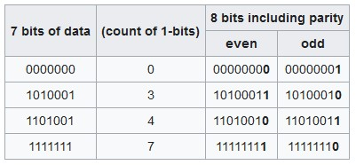

# Secure Software Requirements

### 1. Confidentiality Requirements

- What are these requirements aimed at?
    > Confidentiality requirements are aimed at providing protection against data disclosure. So in simple words, to reduce the risk of having confidential/sensitive documents public (make them accessible for everyone)
- When should these requirements be met and why?
    > These requirements should be met in each SDLC phase, and each part of the application, where we deal with confidential/sensitive data (the whole data lifecycle) until data becomes non longer private/valuable/confidential
    >
    > We distinguish 3 phases in the data lifecycle:
    >>_in transit_:
    >>
    >> "When the data are transmitted over unprotected networks"
    >
    >>_in processing_:
    >>
    >> "When the data are held in computer memory or media for processing"
    >
    >>_in storage_:
    >>
    >> "When the data are at rest, within transactional systems as well as nontransactional systems including archives"
- How to understand which data is confidential/sensitive?
    > In general, data can be classified as public and nonpublic.
    >
    > If the data contains any information regarding health, finances, identity, or any information valuable for the business (e.g. acquisitions, company strategy), so data that can be overused or causes damage, it should be determined as nonpublic, in other words, as confidential/sensitive.
    >
    > More granular classification can be provided by company policy (eg. Strictly Confidential, Restricted, Business Use Only, Public)
- What are the approaches to meeting these requirements? (encryption, hashing, masking)
    >The two common forms of confidentiality protection mechanisms:

    ```mermaid
        flowchart TD
        A[Confidential controls] --- B & C[Masking]
        B[Secret writing] --- D[Covert] & E[Overt]
        D --- F[Steganography] & G[Digital watermarking]
        E --- H[Encryption] & I[Hashing]
    ```

    >_Masking_
    >
    > "is a weaker form of confidentiality protection mechanism in which the original information is either asterisked or X’ed out. You may have noticed this in input fields that take passwords. This is primarily used to protect against shoulder surfing attacks, which are characterized by someone looking over another’s shoulder and observing sensitive information"
    
    >_Secret writing_
    >
    > "is a protection mechanism in which the goal is to prevent the disclosure of information deemed secret"
    >
    >>_Covert_
    >>
    >> "A technique of secret writing to hide information within itself or in some other media or form"
    >
    >>>_Steganography_
    >>>
    >>> "is more commonly referred to as invisible ink writing and is the art of camouflaging or hidden writing, where the information is hidden and the existence of the message itself is concealed"
    >
    >>>_Digital watermarking_
    >>>
    >>> is the process of embedding information into a digital signal. These signals can be audio, video, or pictures. Digital watermarking can be accomplished in two ways: visible and invisible. In visible watermarking, there is no special mechanism to conceal the information, and it is visible to plain sight. This is of little consequence to us from a security standpoint. However, in invisible watermarking, the information is concealed within other media and the watermark is used to uniquely identify the originator of the signal, thereby making it possible for authentication purposes as well, besides confidentiality protection. Invisible watermarking is, however, mostly used for copyright protection, deterring and preventing unauthorized copying of digital media. Digital watermarking can be accomplished using steganographic techniques as well
    >
    >>_Overt_
    >>
    >> commonly referred to as cryptography, includes encryption and hashing
    >
    >>>_Encryption_
    >>>
    >>> uses a bidirectional algorithm in which humanly readable information (referred to as clear text) is converted into humanly unintelligible information (referred to as cipher text). The inverse of encryption is decryption, the process by which cipher text is converted into plain text
    >
    >>>_Hashing_
    >>>
    >>> is a one-way function where the original data or information that needs protection is computed into a fixed length output that is indecipherable. The computed value is referred to as a hash value, digest, or hash sum. The main distinction between encryption and hashing is that, unlike in encryption, the hashed value or hashed sum cannot be converted back to the original data and hence the one-way computation
- Examples
    > “Personal health information must be protected against disclosure using approved encryption mechanisms.”
    > 
    >“Password and other sensitive input fields need to be masked.”
    >
    >“Transport layer security (TLS) such as Secure Socket Layer must be in place to protect against insider man-in-the-middle (MITM) threats for all credit card information that is transmitted.”
    >
    >“The use of nonsecure transport protocols such as File Transfer Protocol (FTP) to transmit account credentials in the clear to third parties outside your organization should not be allowed.”
    >
    >“Log files must not store any sensitive information as defined by the business in humanly readable or easily decipherable form.”

### 2. Integrity Requirements

- What are these requirements aimed at?
    > These requirements are aimed at ensuring the reliability of the application. Moreover preventing unauthorized modifications of data handled by the application, and system integrity which is corresponding to the modification of the software and system configuration itself. So it also provides a system/data consistency
- What are the approaches to meeting these requirements? (input validation, parity bit checking, CRC, hashing)
    > There are 4 distinguished security controls, that provide integrity:
    >> _Input Validation_
    >>
    >> Is an approach to treating any input from a user as a potential threat, which has to be validated in various manners.
    >
    >> _Parity Bit Checking_
    >>
    >> "A parity bit, or check bit, is a bit added to a string of binary code. Parity bits are a simple form of error detecting code. Parity bits are generally applied to the smallest units of a communication protocol, typically 8-bit octets (bytes), although they can also be applied separately to an entire message string of bits.
    >>
    >>The parity bit ensures that the total number of 1-bits in the string is even or odd.[1] Accordingly, there are two variants of parity bits: even parity bit and odd parity bit. In the case of even parity, for a given set of bits, the bits whose value is 1 are counted. If that count is odd, the parity bit value is set to 1, making the total count of occurrences of 1s in the whole set (including the parity bit) an even number. If the count of 1s in a given set of bits is already even, the parity bit's value is 0. In the case of odd parity, the coding is reversed. For a given set of bits, if the count of bits with a value of 1 is even, the parity bit value is set to 1 making the total count of 1s in the whole set (including the parity bit) an odd number. If the count of bits with a value of 1 is odd, the count is already odd so the parity bit's value is 0. Even parity is a special case of a cyclic redundancy check (CRC), where the 1-bit CRC is generated by the polynomial x+1."
    >>
    >> 
    >>
    >> source: Wikipedia
    >
    >> _Cyclic Redundancy Checking (CRC)_
    >>
    >> "Upon data transmission, each block of data is given a computed CRC value, commonly referred to as a checksum. If there is an alteration between the origin of data and its destination, the checksum sent at the origin will not match the one that is computed at the destination."
    >
    >> _Hashing_
    >>
    >> is an action of mapping input data into hash values
- Examples
    > “All input forms and query string inputs need to be validated against a set of allowable inputs before the software accepts it for processing.”
    >
    > “Software that is published should provide the recipient with a computed checksum and the hash function used to compute the checksum, so that the recipient can validate its accuracy and completeness.”
    >
    > “All nonhuman actors such as system and batch processes need to be identified, monitored, and prevented from altering data as it passes on systems that they run on, unless explicitly authorized to.”

### 3. Availability Requirements

- What are these requirements aimed at?
    > refers to ensuring the availability of the system and/or data, that is processed by the system, and protecting against destruction of those assets
- What are the metrics that allow you to track the fulfillment of these requirements?
    > to track the fulfillment of these requirements we can use the following metrics:
    >
    >> _MTD - Maximum Tolerable Downtime_
    >>
    >> "is the measure of the maximum amount of time that the software can be in a state of not providing expected service. In other words, it is the measure of the minimum level of availability that is required of the software for business operations to continue without unplanned disruptions as per expectations."
    >
    >> _RTO - Recovery Time Objective_
    >>
    >> is the amount of time by which the system or software needs to be restored back to the expected state of business operations for authorized business users when it goes down
    >
    > Both of them should be explicitly stated in the SLA, which stands for Service Level Agreement, that includes all important expectations regarding the availability of the system and/or data. Those requirements and metrics should be prepared based on Business Impact Analysis (BIA).
- Examples
    > “The software shall ensure high availability of five nines (99.999%) as defined in the SLA.”
    >
    > “The number of users at any one given point of time who should be able to use the software can be up to 300 users.”
    >
    > “Software and data should be replicated across data centers to provide load balancing and redundancy.”

### 4. Authentication Requirements

- What are these requirements aimed at?
    > ...
- 2FA is the implementation of which security design principle?
    > ...
- Most common auth types
  - cons and pros
    > ...
  - what cases each of them is suitable for and why?
    > ...

### 5. Authorization Requirements

- What are these requirements aimed at?
    > ...
- What CRUD is?
    > ...
- Access control models (description, cons and pros):
  - Discretionary Access Control (DAC)
    > ...
  - Non-Discretionary Access Control (NDAC)
    > ...
  - Mandatory Access Control (MAC)
    > ...
  - Role-Based Access Control (RBAC)
    > ...
  - Resource-Based Access Control
    > ...
- Examples
    > ...

### 6. Accountability Requirements

- What are these requirements aimed at?
    > ...
- Logging:
  - Describe the format (who/what/where/when)
    > ...
  - What events need to be logged? (failed attempts, successful attempts, limits exceeding, etc.)
    > ...
- Examples
    > ...

### 7. Session Management Requirements

- What are these requirements aimed at?
    > ...
- What are the approaches to meeting these requirements?
    > ...
- Examples
    > ...

### 8. Errors & Exception Management Requirements

- What are these requirements aimed at?
    > ...
- What are the approaches to meeting these requirements?
    > ...
- Examples
    > ...

### 9. Configuration Parameters Management Requirements

- What are these requirements aimed at?
    > ...
- What are the approaches to meeting these requirements?
    > ...
- Examples
    > ...

### 10. Operational Requirements

- What are these requirements aimed at?
    > ...
- What are the approaches to meeting these requirements?
    > ...
- Examples (backups, patching, secret management, incident management)
    > ...

### 11. Deployment Environment Requirements

- What are these requirements aimed at?
    > ...
- What are the approaches to meeting these requirements?
    > ...
- Examples
    > ...

### 12. Protection Needs Elicitation (PNE) Techniques

- Brainstorming
    > ...
- Surveys (Questionnaires and Interviews)
    > ...
- Policy Decomposition
    > ...
- Data Classification
    > ...
- Subject-Object Matrix
    > ...
- Use Case & Misuse Case Modeling
    > ...
